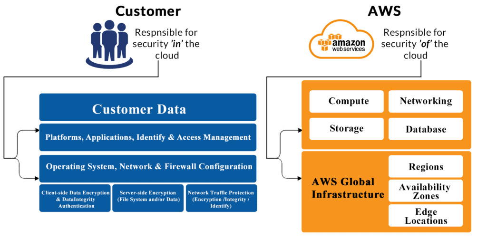
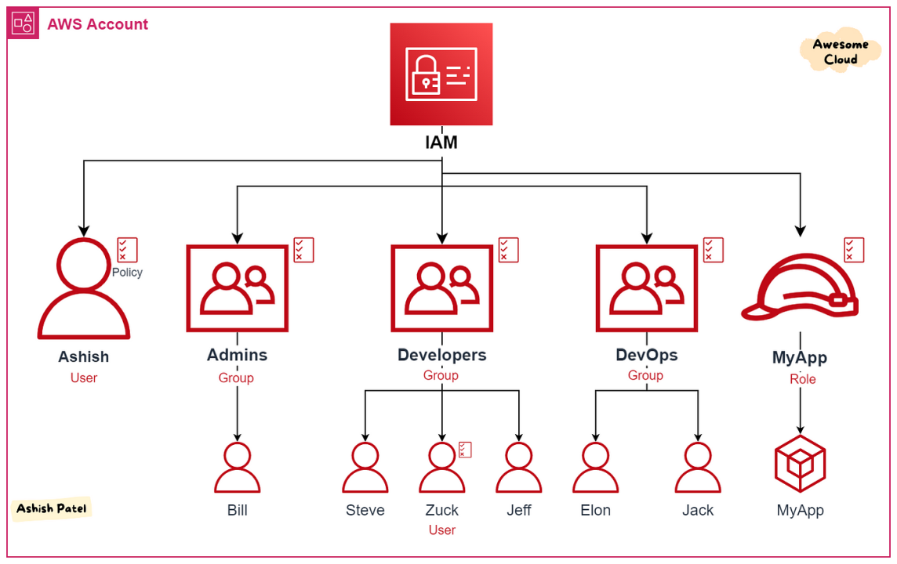
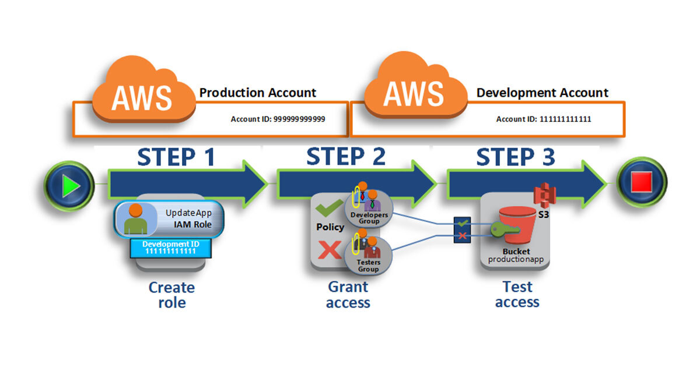
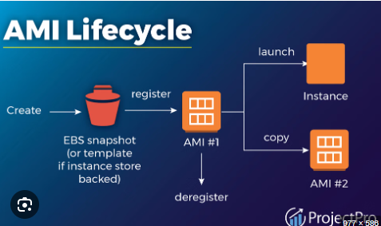
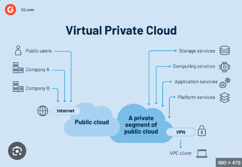
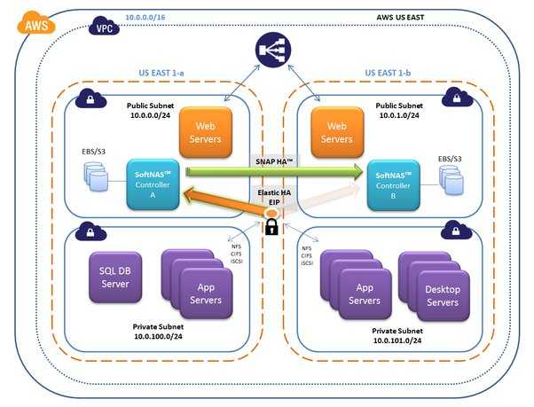

# AWS Cloud Foundations – Two

## 1.Explain the AWS Shared responsibility model.

The AWS shared responsibility model is a concept of dividing responsibilities between AWS and a Customer.
**Responsibility of AWS**
AWS's responsibility is the security of the cloud.
AWS manages all infrastructure layers.
Some of the infrastructure layers are:
- Data centers
- Hardware and software
- Virtualization
- Networking

**Responsibility of a Customer**
Customers' responsibility is the security of everything they make in AWS Cloud.
Customers have complete control over your content.
Customer manages AWS services, software, and access to the data.
Customer responsibilities are security in the cloud.

## 2.Explain an AWS Identity and Access Management (IAM) Role.
Amazon IAM provides management of access to AWS services with fine grained control. Individual users and groups can be created and their persmissions are described in policies (JSON documents). IAM roles can have defined permissions and be assigned to users, applications and services.

## 3.Explain an AWS Identity and Access Management (IAM) Policy.
The difference between IAM roles and policies in AWS is that a role is a type of IAM identity that can be authenticated and authorized to utilize an AWS resource, whereas a policy defines the permissions of the IAM identity.
IAM is a framework of policies and technologies to ensure that the right users have the appropriate access to technology resources. An AWS IAM policy defines the permissions of an identity (users, groups, and roles) or resource within the AWS account. An AWS IAM policy regulates access to AWS resources to help ensure that only authorized users have access to specific digital assets. Permissions defined within a policy either allow or deny access for the user to perform an action on a specific resource.

## 4.Describe an Amazon Machine Image (AMI).
An Amazon Machine Image (AMI) is a master image for the creation of virtual servers -- known as EC2 instances -- in the Amazon Web Services (AWS) environment.

The machine images are like templates that are configured with an operating system and other software that determine the user's operating environment. AMI types are categorized according to region, operating system, system architecture -- 32- or 64-bit -- launch permissions and whether they are backed by Amazon Elastic Block Store (EBS) or backed by the instance store.

## 5.List the different Amazon EC2 instance types with use cases for each type.
**General Purpose Instances**
 
T Series (T2, T3, T3a, T4g)
Ideal for general-purpose workloads such as web servers, development environments, and small databases.
 
M Series (M5, M5a, M5n, M5zn, M6g, M7g
Suitable for a wide range of applications including small and mid-sized databases, data processing tasks that require a balance of compute, memory, and network resources.
 
**Compute Optimized Instances**
 
C Series (C5, C5a, C5n, C6g, C6gn, C7g)
Best for compute-intensive tasks that require high-performance processors. These include scientific modeling, batch processing, ad serving, and high-performance web servers.
 
**Memory Optimized Instances**
 
R Series (R5, R5a, R5n, R6g, R7g)
Ideal for memory-intensive applications such as high-performance databases, in-memory caching, and real-time big data analytics.
 
X Series (X1, X1e, X2gd)
Designed for extremely large in-memory databases and memory-bound applications.
 
**Storage Optimized Instances**
I Series (I3, I3en)
Optimized for applications that require high, sequential read and write access to very large data sets on local storage. Ideal for NoSQL databases, data warehousing, Elasticsearch, and analytics workloads.
 
D Series (D2, D3, D3en)
Designed for workloads requiring high sequential read and write access to very large data sets. These instances are ideal for distributed file systems, data warehousing, and Hadoop/Spark workloads.
 
H Series (H1)
Suitable for high-disk throughput and data-intensive workloads.
 
Accelerated Computing Instances
P Series (P3, P4)
Optimized for machine learning and high-performance computing (HPC) applications. They provide powerful GPU capabilities for training and inference.
 
G Series (G4, G5)
Designed for graphics-intensive applications such as video transcoding, game streaming, and machine learning inference.
 
F Series (F1)
Offers customizable hardware acceleration with field-programmable gate arrays (FPGAs). Suitable for use cases that require specialized hardware acceleration.
 
**High Performance Computing Instances**
HPC Instances (Hpc6id, Hpc6a)
Specifically designed for high performance computing (HPC) workloads that require high bandwidth, low latency networking, and high-performance processors.
 

## 6.Explain Amazon Virtual Private Cloud (VPC).
**Amazon Virtual Private Cloud (VPC)** allows you to provision a logically isolated section of the AWS cloud where you can launch AWS resources in a virtual network that you define.
 
**Key features of Amazon VPC include:**
Customizable Network Configuration: You can define your IP address range, create subnets, and configure route tables and gateways.
Security: Utilize security groups and network access control lists (ACLs) to control inbound and outbound traffic at the instance and subnet level.
Isolation: Resources within a VPC are isolated from other VPCs and can be further segregated using subnets and network ACLs.

## 7.Differentiate between a Public and a Private subnet.
**A subnet** is a range of IP addresses in a VPC (Virtual Private Cloud) that can be used to isolate resources within a network.

**A public subnet** is a subnet that has direct access to the internet, typically through an Internet Gateway attached to the VPC. Public subnets are used for resources that need to be accessible from the internet, such as a web server or a database.

**A private subnet** is a subnet that does not have direct access to the internet. Private subnets are used for resources that should not be directly accessible from the internet, such as databases or application servers. To access the internet, resources in private subnets typically route through a NAT gateway or a VPN connection.

**Gruoups**
Mohammad Assd Iqbal
William
Tikere
IKechukwu
Shaza